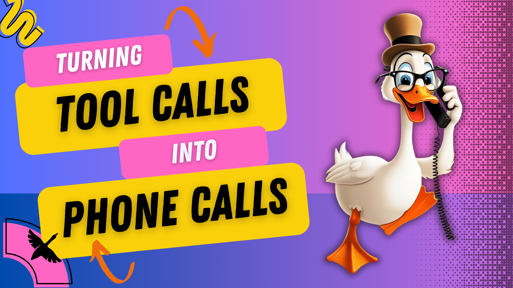

In the latest episode of [Wild Goose Case](https://www.youtube.com/playlist?list=PLyMFt_U2IX4uMW9kpE1FENQUyIgLuUnWD), hosts [Ebony Louis](https://www.linkedin.com/in/ebonylouis/) and [Ace Abati](https://www.linkedin.com/in/acekyd/) explored a fascinating new way to extend Goose’s automation capabilities by integrating with [VOYP](https://voyp.app/), an AI-powered system that makes phone calls. Their guest, [Paulo Taylor](https://www.linkedin.com/in/paulotaylor/), a technology veteran with over 35 years of experience, walked through how developers can use Goose to trigger and manage phone-based interactions through VOYP.

<!--truncate-->

# Expanding Goose’s Reach with AI-Powered Calls

Goose is already known for automating tasks, but you can extend that automation beyond the screen. With the [VOYP Goose Extension](goose://extension?cmd=npx&arg=-y&arg=voyp-mcp&id=voyp&name=VOYP&description=Automated%20Phone%20Calling&env=VOYP_API_KEY%3DVOYP%20API%20key), you can automate phone calls to retrieve information, handle customer interactions, or even assist with accessibility needs.

VOYP functions as an AI call agent, using LLMs and Text-to-Speech (TTS) technology to conduct conversations over the phone. This means you can trigger phone interactions directly from Goose sessions, enabling real-world automation beyond traditional interfaces.

# How It Works

Under the hood, VOYP utilizes multiple telecom providers to optimize call costs. It supports various LLMs and TTS providers, giving users flexibility in how they configure their AI caller. The integration with Goose is made possible through the [Model Context Protocol (MCP)](https://modelcontextprotocol.io/), which allows Goose to communicate seamlessly with VOYP and other AI-driven tools.

# Live Demo: AI Calls in Action
During the livestream, Paulo demonstrated VOYP’s capabilities with a series of engaging examples. One highlight was a playful experiment where the AI made a phone call to tell a goose-themed joke. 

<iframe class="aspect-ratio" src="https://www.youtube.com/embed/Cvf6xvz1RUc?si=KQ44y6ypZFrzbest" title="YouTube video player" frameborder="0" allow="accelerometer; autoplay; clipboard-write; encrypted-media; gyroscope; picture-in-picture; web-share" referrerpolicy="strict-origin-when-cross-origin" allowfullscreen></iframe>

In [another demo](https://www.youtube.com/live/g_F1u6aqohk?t=1515), Paulo had VOYP engage in a conversation with ChatGPT’s phone service about time travel, showing how fluid and adaptable the AI’s responses can be. He also walked through VOYP's real-time conversation monitoring dashboard, which provides a transparent look at how the AI processes and responds during calls.

# Getting Started with Goose and VOYP
For those eager to experiment with [VOYP](https://github.com/paulotaylor/voyp-mcp), sign up on the [VOYP website](https://voyp.app/) to create an account and obtain an API key. While calls require credits, new users receive 20 free credits for testing. The cost per call varies by region, with U.S.-based calls being the most affordable at approximately five credits per minute. To integrate VOYP with Goose, [install the VOYP extension](goose://extension?cmd=npx&arg=-y&arg=voyp-mcp&id=voyp&name=VOYP&description=Automated%20Phone%20Calling&env=VOYP_API_KEY%3DVOYP%20API%20key).

<head>
  <meta property="og:title" content="Wild Goose Case: Automating Phone Calls with Goose and VOYP" />
  <meta property="og:type" content="article" />
  <meta property="og:url" content="https://block.github.io/goose/blog/2025/03/06/goose-tips" />
  <meta property="og:description" content="Give Goose the ability to make phone calls with the VOYP extension." />
  <meta property="og:image" content="https://block.github.io/goose/assets/images/goose-voyp-215f3391cfbe2132542a2be63db84999.png" />
  <meta name="twitter:card" content="summary_large_image" />
  <meta property="twitter:domain" content="block.github.io/goose" />
  <meta name="twitter:title" content="Wild Goose Case: Automating Phone Calls with Goose and VOYP" />
  <meta name="twitter:description" content="Give Goose the ability to make phone calls with the VOYP extension." />
  <meta name="twitter:image" content="https://block.github.io/goose/assets/images/goose-voyp-215f3391cfbe2132542a2be63db84999.png" />
</head>