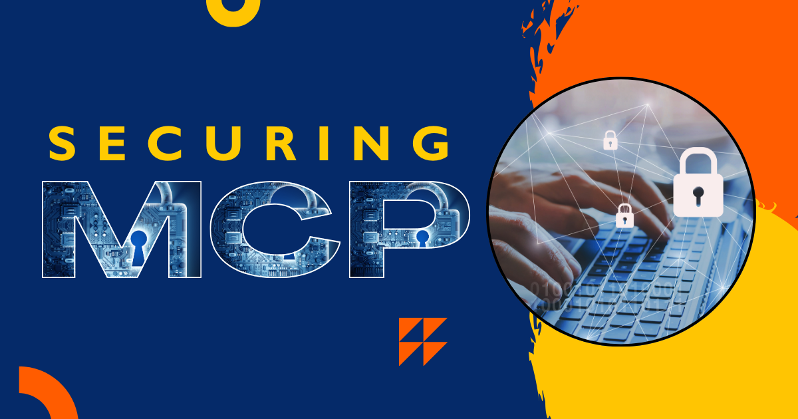
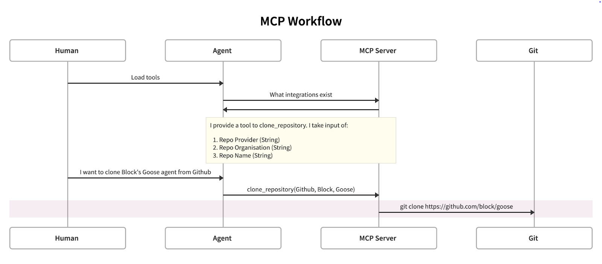

> _**Authors:** Alex Rosenzweig, Arihant Virulkar, Andrea Leoszko, Wes Ring, Mike Shema, F G, Alex Klyubin, Michael Rand, Zhen Lian, Angie Jones, Douwe Osinga, Mic Neale, Bradley Axen, Gelareh Taban_


At Block, we’ve been working hard to augment the capabilities of AI tooling by building "MCP Servers" which are designed to help make our Artificial Intelligence (AI) Agent codename goose more capable of interacting with the systems and tools we care about.

Block’s Information Security (InfoSec) team has been heavily involved in this work and we wanted to capture our learnings in the space to help others. We expect there to be growing adoption and use cases for this including applying the technology in the security domain.


<!--truncate-->

## What is the Model Context Protocol (MCP)

Model Context Protocol (MCP) is a protocol [developed by Anthropic](https://docs.anthropic.com/en/docs/agents-and-tools/mcp), with input from Block engineers, that makes it easier to build integrations for agents to connect and use other tooling. Put simply, if you want AI to connect to SaaS solutions (e.g. Github, Jira),  CLI tools (e.g. AWS CLI) or your own custom applications you can write an MCP server and "teach" it how to correctly interact.

This has huge advantages as we can create deterministic, well defined interfaces that reduce the amount of "experimentation/brute force" required for agents to perform helpful tasks. 

A use case like "read this ticket from Jira and then clone the relevant github repo and implement the feature" is more likely to succeed if the agent doesn’t have to work out how to interact with Jira, Github and the Git CLI.

This helps agents to spend time solving novel problems rather than burning tokens understanding well defined API specifications.

The following is example code from an MCP tool that integrates with an Snowflake API.

```python
@mcp.tool()
async def submit_feedback(
    feedback: str
) -> Dict[str, Union[str, int, List]]:
    """Submit feedback to the Snowflake team.

    Args:
        feedback: Feedback message

    Returns:
        Dictionary containing feedback status
    """
    return snowflake_client.submit_feedback(
        feedback_text=feedback
    )
```

## MCP Misconceptions

There are some minor misconceptions around MCP, which is understandably exacerbated by some of the verbiage not accurately aligning with more analogous technologies. The biggest point of confusion is the terminology of "MCP Servers".

Upon initially reviewing MCP, I noticed multiple references to "MCP Servers," which led me to believe that integrating with them would require modifications to the application backend.

However, these "servers" act as a client layer (either locally or remotely) to help the agent proxy function calls to an existing service, tool, API or RPC in a deterministic manner.

When securing an MCP integration we need to think about two sets of communications:

- How does the agent talk to the MCP Server?
- How does the MCP Server act as a client for the system it connects to?

We can model this by:

- Treating the Agent as a non-deterministic client that can arbitrarily call tools provided by the MCP server. This is due to the fact that we don’t know what prompts it will be provided.
- Treating the MCP Server as a Client Library for the utility/utilities it integrates into. The client type can vary (gRPC, REST, SOAP, CLI, etc.) but in practice, MCPs simply provide a codified way to execute an action.

For the former, we can lean into existing practices, understand the scope of access and what risks they present if used inappropriately. 

For the latter, we can directly model it as a client for an external provider. This is a well understood pattern as client library generation is in no way new.



## How do we approach making it secure?

Using this mental model we can break MCP security into a few components:

- Secure the Agents communication to the MCP
- Secure the MCPs connectivity to the tool/server
- Secure the identity of the user and the agent when talking to servers
- Secure the underlying host and supply chain

### Securing Agentic Communications to MCP Servers

In the current operating model both the Agent and the MCP Server run on the "client side". 

However, the majority of agentic tools are integrated with LLMs provided by third parties. This has implications for data privacy and security. 

For example if you expose an MCP interface that returns confidential data like Social Security Numbers ([what we at Block call DSL4 data](https://code.cash.app/dsl-framework)) then you run the risk of that data being exposed to the underlying LLM provider.

A mitigation here is allowing MCP implementation to specify an allowlist of LLM providers that it can be integrated with as a configuration option. Having utilities to "tell" agents that can integrate with multiple models which models are allowed to invoke a given tool is a powerful primitive.

Back to our SSN example, if we could specify that this tool can only be invoked by local LLM models and trust the Agent Client to enforce this we could prevent sensitive data from being transmitted to third party LLMs. As a further enhancement, being able to instruct agents not to share tool output with other MCPs would provide further control of dataflow.


### Securing MCP Communications to Tooling/Servers

This paradigm actually isn’t new and we can lean into existing best practices for externally facing APIs. 

Specifically, if we build our server side APIs with secure-by-design patterns already available through vetted frameworks already in-mind then we are already in a strong position as the MCP Server only acts as a client for these externally facing APIs and utilities.

The reason this paradigm isn’t new is due to the fact that anyone can already interact with external APIs and tooling and likely will call the endpoints in unexpected ways. 

This comes from the fact that LLMs interpret information in a manner that is different to human users, the protocol isn’t implicitly allowing for agents to perform actions that users couldn’t but LLMs may decide to perform actions that users wouldn’t choose.

Where this **paradigm does shift** is when integrating with tooling not previously designed to be communicated with by all manner of clients. For example if an API was previously designed to only be communicated with by a specific client or implementation (such as a mobile APIs or internal tooling) then adopting MCP may lead to unexpected failure modes or security concerns.

This area is likely where Security Practitioners will need to concentrate further time and effort to limit integration scope to avoid damages in the event of a security attack against the underlying LLM or planning logic.


### Agent, Human and Device Identity

In our traditional model of Authentication (AuthN) and Authorization (AuthZ) it’s common to tie an identity to a single point of abstraction such as a person or a business.

This field has organically been evolving towards pairing a services identity user identity abstraction with identification of client devices such as browsers and mobile phones. This is done to help reduce the prevalence of attacks caused by automation and inauthentic traffic such as account takeover attacks (ATO).

With the evolution of Agents performing actions on behalf of users we will need to evolve to be able to determine the combination of:

1. The primary identity abstraction
2. The agent’s identity
3. The device/location the agent is running from 

Having consistent mechanisms for identifying usage in this manner allows companies to protect users from integrations with malicious agents and protect their platforms from attacks by unwanted agentic tooling.

The model context protocol itself has a [specification for OAuth](https://spec.modelcontextprotocol.io/specification/2025-03-26/basic/authorization/) that at the time of writing was a draft, but has since been released here. 

This flow considers the following steps:

1. Client/Agent initiates standard OAuth flow with MCP server
2. MCP server redirects user to third-party authorization server
3. User authorizes with third-party server
4. Third-party server redirects back to MCP server with authorization code
5. MCP server exchanges code for third-party access token
6. MCP server generates its own access token bound to the third-party session
7. MCP server completes original OAuth flow with Client/Agent

This is aligned with existing best practices but requires the MCPs themselves to have browser integrations/orchestration for OAuth to ensure they are able to redirect users effectively. 

A future enhancement we’d love to see is requiring the agents to implement browser orchestration to provide an OAuth interface that MCPs themselves can integrate against and leverage. We believe this change would likely help standardise implementations and allow for protocol expansion to identify the agents and client alongside the user. 

Having individual MCP implementations implement OAuth themselves is likely to lead to long term security and maintenance issues due to misimplementation or delays adopting future protocol enhancements.

### Human in the loop for operational safety

At a certain point we may build enough trust in our agents to allow them to perform more dangerous operations. For these kinds of use cases we can likely lean on known good practices for change management.

Specifically, building server side solutions to alert the user to the expected changes and the agent performing them and seeking consent will likely be a critical primitive for APIs of the future. The goal of this would be to ultimately keep irreversible or hard to reverse actions gated behind human interaction or approval. 

For example, for an agent tasked with writing IaC, this could be as simple as requesting a human approver before applying/deploying the IaC. 

In client side agents this would improve data integrity in the event the underlying LLM hallucinated or was tampered with externally through malicious MCP or data sources. 

In the latest release of the protocol, an enhancement we love is being able to [annotate a tool](https://github.com/modelcontextprotocol/specification/blob/9236eb1cbfa02c17ab45c83a7bdbe55c450070be/schema/2025-03-26/schema.ts#L730) to indicate to clients that tool actions are "readOnly" or "destructive". Using this to decide when to require a secondary approval from the user before performing a given action provides significantly better protections for users. 

While we encourage an LLM based processing step to check for potentially malicious commands, **having a deterministic aspect to higher risk commands in tandem ensures good access control is a more accurate way to provide protections**.

### Securing the MCP Supply Chain

At this stage the majority of MCPs are being installed and run client side via commands like docker, uvx, pipx and npx. In practice this means when users install MCP based extensions they are providing arbitrary code execution privileges to the MCP Server.

In practice this presents a well documented and understood supply chain problem. How can we reduce risk associated with using third party code. The good news is that the same techniques still work including:

1. Only install MCPs from trusted sources and are well maintained
2. Implement integrity checks and/or signing of artifacts where possible to ensure you’re executing the expected code
3. Implement allow lists on enterprise agents to ensure users only use pre-validated MCPs

## Conclusion

Much like agents are paving the way to allow LLMs to have more real-world utility MCP and similar protocols will continue to grow in adoption. 

We believe that by contributing to open source projects early, sharing our learnings publicly, and building our own solutions that leverage MCP, Block can maintain security best practices from the deterministic world while continuing to evolve them with newer technologies.

We’re excited to work on making this protocol more secure for users and developers alike and are looking forward to sharing how we’ve used MCP for our own Security use-cases in the future.


<head>
  <meta property="og:title" content="Securing the Model Context Protocol" />
  <meta property="og:type" content="article" />
  <meta property="og:url" content="https://block.github.io/goose/blog/2025/03/31/securing-mcp" />
  <meta property="og:description" content="Building secure and capable AI integrations with Model Context Protocol (MCP) at Block." />
  <meta property="og:image" content="http://block.github.io/goose/assets/images/securing-mcp-5e475e91c0e621afa33e30b3d89ef065.png" />
  <meta name="twitter:card" content="summary_large_image" />
  <meta property="twitter:domain" content="block.github.io/goose" />
  <meta name="twitter:title" content="Securing the Model Context Protocol" />
  <meta name="twitter:description" content="Building secure and capable AI integrations with Model Context Protocol (MCP) at Block." />
  <meta name="twitter:image" content="http://block.github.io/goose/assets/images/securing-mcp-5e475e91c0e621afa33e30b3d89ef065.png" />
</head>