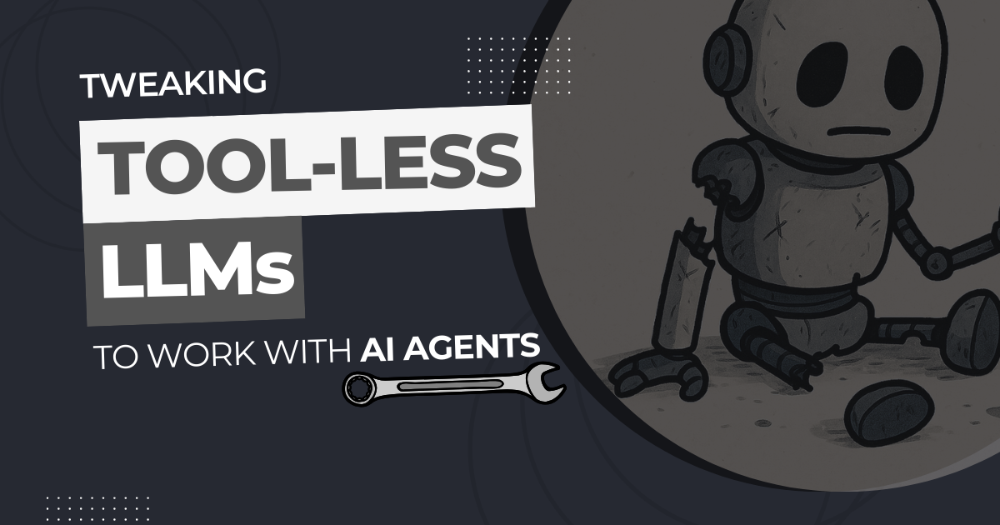
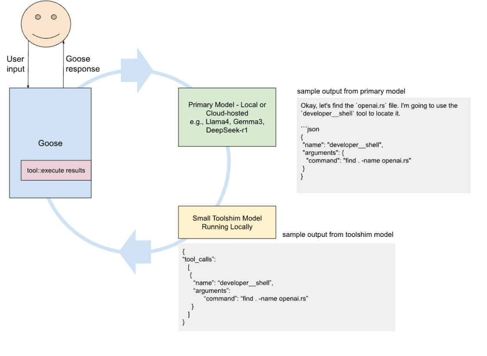
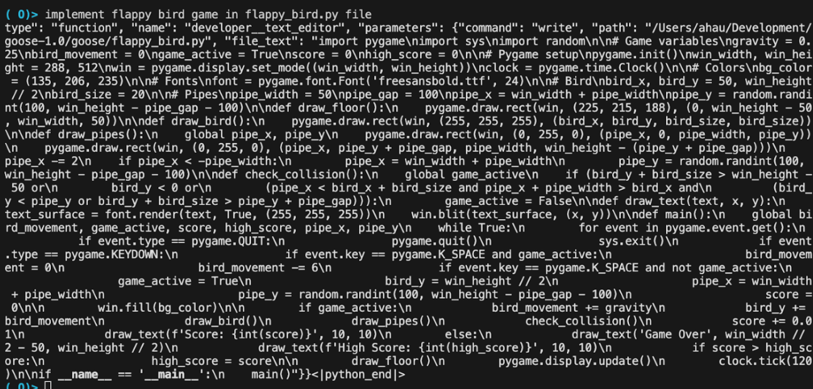
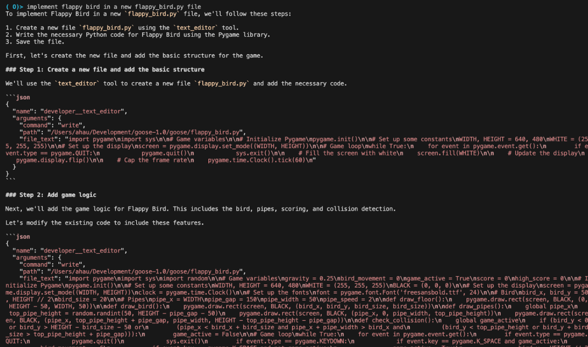

Our recently published [Goose benchmark](https://block.github.io/goose/blog/2025/03/31/goose-benchmark) revealed significant performance limitations in models where tool calling is not straightforwardly supported (e.g., Gemma3, Deepseek-r1, phi4). These models often fail to invoke tools at appropriate times or produce malformed or inconsistently formatted tool calls. With the most recent releases of Llama4 and Deepseek v3 (0324), we are again observing challenges with effective tool calling performance, even on these flagship openweight models.

<!--truncate-->

## Why tool calling is important

Tool calling is a critical capability for agents like goose. It allows models to go beyond text and image generation and take concrete actions, such as executing code, querying databases, searching the web, or interacting with design tools like Figma. Equipping agents with a broad set of tools empowers them to discover and interface with external systems, much like a human would. While this might be overkill for narrow, more deterministic applications of LLMs, it is essential for general-purpose agents like goose. Without reliable tool calling, we limit what models can do to help us automate, remove toil and navigate complex systems. Pure generation–of text, images, speech, and video–is just the first step on the path to more powerful agentic capabilities. There is so much more that models can do if we give them the legs to run.

## Background: using a local model as a "toolshim"

The goal is to allow goose to work with the widest variety of models possible. A "toolshim" in this case is a thin layer which sits between the main model doing the agent work, and the tools that can perform actual actions (making the agent take action, vs being a chatbot). Previously we have been trying this approach with open models including in this [past benchmark](https://block.github.io/goose/blog/2025/03/31/goose-benchmark) post. A toolshim, if it can work, unlocks both powerful cutting edge models (open weight and closed) which while may perform well on various benchmarks, fall well short when tool calling for agents is required (or perhaps don't, by design, support tool calling at all, such as the case with some reasoning models).

## Proposal: Fine-tune a lightweight toolshim model (up to 12b)

Develop a dedicated toolshim model that translates open-source model outputs into well-structured tool calls, acting as a reliable post-processor to standardize across model families trained that currently exhibit inconsistent and unreliable tool call generation behavior. We do not use tool calling apis even if available, but provide tool context in the system prompts.

We already experimented with this in the [benchmarking effort](https://block.github.io/goose/blog/2025/03/31/goose-benchmark), finding that phi4 (14b) and gemma3 (27b) achieved close performance to llama3.3 (70b) when used with a generic local model (mistral-nemo) as the shim. This shows potential for furthering their performance with more focused attention on improving the shim's performance.

Toolshim System Sketch:

## Key Observations on Current Challenges with Tool Call Generation

1. **Model training templates are inconsistent**  
   For example, [Qwen models use](https://qwen.readthedocs.io/en/latest/framework/function_call.html) [Hermes-style tool formats](https://github.com/NousResearch/Hermes-Function-Calling), while Openhands generates Markdown despite explicit JSON instructions—suggesting training data shape can have an underestimated impact on reliable tool call generation  

2. **Current workarounds aren't enough**  
   [Model providers may implement approaches like guided decoding](https://docs.vllm.ai/en/latest/features/tool_calling.html) to guarantee validly-parsable function calls, but these may not produce high-quality outputs if the model wasn't trained on schemas matching what users provide in context. The widespread challenges with tool use with Llama4 may be indicative of the challenges providers have in effectively serving new models to make full use of their capabilities  

3. **Hosting providers vary wildly in how well they work with tool calls**  
   Hosting providers helpfully provide chat templates or similar which can, in many cases, prompt some of the larger models to reply correctly formatted tool calls, and thus can support openai-like apis where tools are provided, but in practice these can fall short after one shot, or vary a lot between providers (an issue exacerbated if using model routers such as openrouter or huggingface hosted inference)

### Some examples of model-specific quirks wrt tool calling:

**Openhands**: Despite instructions to generate JSON-formatted tool calls, still generates markdown (likely due to shape of their training data) 

**Llama4 Maverick**: Generates malformed tool calls, but performs somewhat better when specifically prompted to generate tool calls as JSON

With "tool calls" on OpenRouter:  

Llama4 Maverick when instead just prompted to generate tool calls in JSON:  

**Gemma3**: A DeepMind engineer [suggested providing a function calling template in-context in Python format](https://www.philschmid.de/gemma-function-calling)  
The 12B model also outputs valid JSON tool calls reasonably well:  

**Functionary models**: [Ollama couldn't support the tool calling capabilities](https://github.com/MeetKai/functionary/issues/302#issuecomment-2650187280) because these models were trained with prompt templates in a TypeScript schema incompatible with Ollama's supported JSON schema

## Experimentation Approach

### Data Collection

* Extract user messages from historical Goose sessions, and for messages followed by tool calls from Anthropic/OpenAI (all tool calls up to today):  
  * **Regenerate tool calls with open models:** Regenerate the tool calls with the most capable open models that have supported tool calling capabilities (e.g., QwQ, Qwen, deepseek chat v3)  
  * **Generate json/markdown-formatted tool calls to parse:** Instruct the most capable open models (e.g., DeepSeek-r1, Llama4, Gemma3), that don't necessarily have strong tool calling to output tool calls in the correct schema (JSON/markdown). Parse the output into the appropriate tool calls.  
  * **Discard any malformed tool calls, tool calls that fail to properly execute, or tool calls that meet other rejection criteria**  
* Generate a few thousand examples with this approach

### Modeling 

Fine tune small models like mistral-nemo (14b), gemma 4-12b, qwen2.5-coder 7-14b. 

### Evaluations

Test with Goosebench evals run in the benchmarking blogpost. We can directly compare performance of models with and without the finetuned toolshim models supporting them.

## Future approaches

On top of local models, we would like to consider parsers, parser combinators, context-free grammars and more (even very large ones) which are constructed based on 1000s of examples of tool results. Even if large, these can operate at every low latencies extracting parameters for suggested tool calls. There are likely other structured text extraction techniques to be explored to assist with discovery and extraction of tool calls from rich responses from powerful general models.

<head>
  <meta property="og:title" content="Finetuning Toolshim Models for Tool Calling" />
  <meta property="og:type" content="article" />
  <meta property="og:url" content="https://block.github.io/goose/blog/2025/04/11/finetuning-toolshim" />
  <meta property="og:description" content="Addressing performance limitations in models without native tool calling support" />
  <meta property="og:image" content="https://block.github.io/goose/assets/images/toolshim-header-42611f614e7722f90cf83991debe3046.png" />
  <meta name="twitter:card" content="summary_large_image" />
  <meta property="twitter:domain" content="block.github.io/goose" />
  <meta name="twitter:title" content="Finetuning Toolshim Models for Tool Calling" />
  <meta name="twitter:description" content="Addressing performance limitations in models without native tool calling support" />
  <meta name="twitter:image" content="https://block.github.io/goose/assets/images/toolshim-header-42611f614e7722f90cf83991debe3046.png" />
</head>