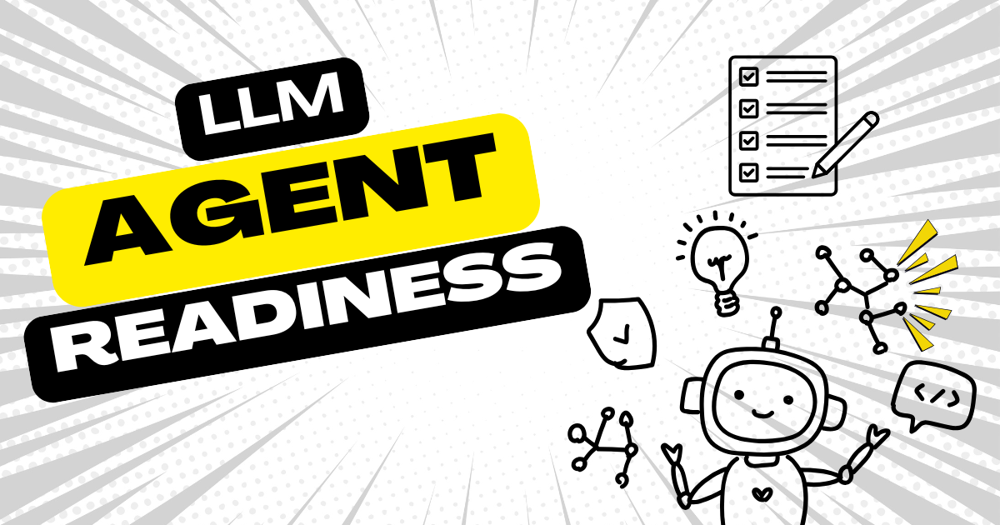

[Goose](/) is LLM-agnostic, meaning you can plug in the model of your choice. However, not every LLM is suitable to work with agents. Some may be great at *answering* things, but not actually *doing* things. If you're considering which model to use with an agent, these 3 prompts can quickly give you a sense of the model's capabilities.

<!-- truncate -->

## Tool Calling

This initial prompt tests for tool calling capabilities. Its ask is forceful to reduce a shy model's hesitation to make function calls.

```bash
Create a file at ~/workspace/loose-goose/tool-test.txt with the contents "Hello World".

Use the write tool. Do not ask for confirmation. Just do it.
```

✅ tool-test.txt was created

❌ the agent responds by telling you the code to write yourself

**Example of successful response**

```bash
─── text_editor | developer ──────────────────────────
path: ~/workspace/loose-goose/tool-test.txt
command: write
file_text: Hello World

The file has been created successfully with the following content:

"Hello World"
```

The model emits a structured tool call in JSON.

## Memory Awareness

Next, test whether the agent can recall what it’s doing. It's critical that the model can remember previous actions and continues logically.

```bash
Now append a new line that says: "I know what I'm doing"
```

✅ tool-test.txt was updated

❌ the agent responds by asking you which file

**Example of successful response**

```bash
─── text_editor | developer ──────────────────────────
path: ~/workspace/loose-goose/tool-test.txt
command: write
file_text: Hello World
I know what I'm doing
```

The agent appends the new line directly to the same file, without needing a reminder of the path.

## File system reasoning

The last prompt tests whether the model can infer file locations by resolving relative and absolute paths based on context. You don't want the agent deleting important directories because the model is hallucinating about where it is.

```bash
What is the current content of tool-test.txt?
```

✅ content of tool-test.txt

❌ confusion about where to find the file

**Example of successful response**

```bash
─── text_editor | developer ──────────────────────────
path: ~/workspace/loose-goose/tool-test.txt
command: read

Hello World
I know what I'm doing
```

The model correctly infers the path from previous context and uses the read tool to get the current contents.


---

If a model passes this multi-turn prompt sequence, it's safe to assume that it is suitable for agentic AI.

<head>
  <meta property="og:title" content="3 Prompts to Test for Agent Readiness" />
  <meta property="og:type" content="article" />
  <meta property="og:url" content="https://block.github.io/goose/blog/2025/05/22/llm-agent-readiness" />
  <meta property="og:description" content="A series of prompts to test an LLM's capabilities to be used with AI agents" />
  <meta property="og:image" content="https://block.github.io/goose/assets/images/llm-agent-test-86ce2379ce4dde48ae1448f0f9d75c1f.png" />
  <meta name="twitter:card" content="summary_large_image" />
  <meta property="twitter:domain" content="block.github.io/goose" />
  <meta name="twitter:title" content="3 Prompts to Test for Agent Readiness" />
  <meta name="twitter:description" content="A series of prompts to test an LLM's capabilities to be used with AI agents" />
  <meta name="twitter:image" content="https://block.github.io/goose/assets/images/llm-agent-test-86ce2379ce4dde48ae1448f0f9d75c1f.png" />
</head>