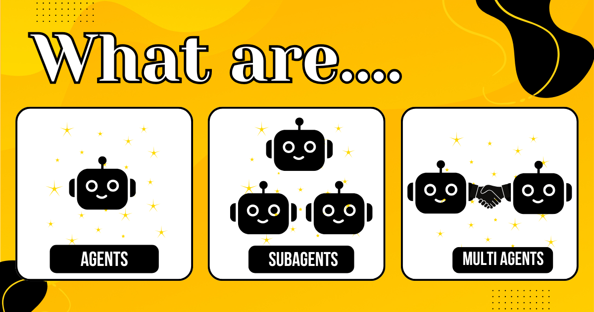

I taught a [vibe coding workshop at UC Berkeley](/blog/2025/08/10/vibe-coding-with-goose-building-apps-with-ai-agents) and informed the students that we'd be spinning up 7 subagents. Someone quickly raised their hand and asked "what is a subagent?". At that moment, I realized we're just throwing out terms like **agent**, **multi agent**, and **subagent**, and not really taking the time to explain what these are. So, here goes... a 101 breaking down these various coordination patterns and when to use them.

<!-- truncate -->

:::tip TL;DR
- **agent** – one autonomous actor that takes your goal and runs with it end to end

- **subagents** - a setup where a main agent acts as orchestrator, delegating work to other agents it controls. The main agent owns the flow, order, and coordination.

- **multi agents** – two or more main agents, each acting independently but able to collaborate, negotiate, or exchange results. No single agent is "the boss".
:::

These terms sound fancy, but at the end of the day, these are just different ways to get stuff done with AI. Kind of like deciding if you want to work solo, pair program, or lead a squad.

**Let me illustrate this with a simple new feature: adding dark mode to our company’s web app.**

## The Agent: Solo Hero Mode

You give the task to one AI agent, such as [Goose](/). The agent is an autonomous actor, essentially your army of one.

You tell your agent, "Add dark mode to the app." It reads the repo, updates the CSS and themes, runs tests, and opens a PR. It handles the whole thing start to finish. No teammates, no handoffs.

If the agent messes up on one of these steps (e.g. say it forgets to update the toggle in the settings menu), it has to backtrack and fix it itself.

Think lone developer grinding through the ticket.

## The Subagent Setup: Orchestrator With a Crew

With [subagents](/docs/experimental/subagents), you still have one "main" agent, but instead of doing everything, it plays tech lead and delegates pieces of the work to other specialized agents.

The main agent says:

- _"Designer agent, create the dark mode color palette."_
- _"Frontend agent, apply it to all UI components."_
- _"QA agent, run visual regression tests."_

These subagents may work in parallel (e.g. while Designer is doing the palette, Frontend is updating styles) or sequentially (e.g. Frontend waits until Designer is done).

The main agent keeps everything on track, collects the results, and stitches them together.

Think of this as a tech lead breaking the feature into subtasks, assigning them, and merging the work.

## The Multi Agent Scenario: Two Main Brains Talking It Out

With multi agents, there's no single orchestrator. You've got multiple main agents that talk to each other, each with its own goals or perspective.

For our dark mode feature, imagine:

- The dev agent knows the codebase and can implement the UI changes.
- The UX research agent knows how users interact with themes and what accessibility needs to be considered.

They work together. The UX agent explains the best practices, edge cases, and user pain points, while the dev agent implements and checks back for feedback. They might even run on different systems, like your dev agent calling an external design agent hosted somewhere else.

It's worth noting that multi agent setups don't have to be working on the exact same task. Sometimes they’re just operating in the same environment and will collaborate when their work overlaps.

Think of this as two peers hashing it out over Slack until they've got something solid.

## When to Use Which

- **agent**: small, self-contained tasks you trust one AI to own
- **subagents**: complex tasks that benefit from dividing and conquering with oversight
- **multi agents**: requires multiple brains or perspectives that can negotiate and collaborate

These setups are just different ways to organize work, whether it's human work or AI work. The trick is picking the structure that gets you the best balance of speed and accuracy.

<head>
  <meta property="og:title" content="Agents, Subagents, and Multi Agents: What They Are and When to Use Them" />
  <meta property="og:type" content="article" />
  <meta property="og:url" content="https://block.github.io/goose/blog/2025/08/14/agent-coordination-patterns" />
  <meta property="og:description" content="A straightforward explanation of how agents are organized to work together" />
  <meta property="og:image" content="https://block.github.io/goose/assets/images/agent-coordination-52282acab8107e9503b17e471465ffa5.png" />
  <meta name="twitter:card" content="summary_large_image" />
  <meta property="twitter:domain" content="block.github.io/goose" />
  <meta name="twitter:title" content="Agents, Subagents, and Multi Agents: What They Are and When to Use Them" />
  <meta name="twitter:description" content="A straightforward explanation of how agents are organized to work together" />
  <meta name="twitter:image" content="https://block.github.io/goose/assets/images/agent-coordination-52282acab8107e9503b17e471465ffa5.png" />
</head>